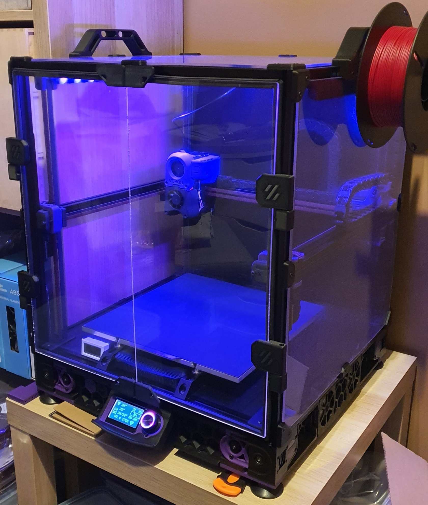

# v2.4-1755-klipper_config

Klipper configs for this printer running fluidd.

# Table of Contents
**(!)** = has important warning
- [**(!)** Change Log](#change-log)
- [Printer Mods](#printer-mods)
- [Klipper Plugins](#klipper-plugins)
- [Credits](#credits-in-no-particular-order)

# Change Log

Changes will be noted here by date, title if needed, files changed, summary of changes. 

_**Note: only changes of signifigance will be added.**_

- **24-11-2021:** Add nevermore filter warning.
    * Added
        * `saved_cariables.cfg`
            * To get the total's already in fluidd calculate the total time over to seconds and use it in `totalprintingtime`. For total filament used, multiply it by 1000 to get the value in mm.
            * `filament_used = 0`
            * `filterusetime = 0`
            * `lastservicetime = 0`
            * `totalprintingtime = 0`
        * `macros/user_variables.cfg`
            * variable_nevermore_use_time: 80 ; Nevermore change warning limit (In hours)`
        * `macros/statistics.cfg`
            * Grab the whole file, it's new. Thanks to [zellneralex](https://github.com/zellneralex/klipper_config/blob/master/printtime.cfg) for making this awesome thing.
        * `macros/printing.cfg`
            * Add this to the `[PRINT_END]` macro to start adding time to the statistics, and checking the filter run-time:
            * `_ADD_PRINT_TIME`
            * `_SD_PRINT_STATS R='done'`
            * `_SD_PRINTER_STATS`

# Printer Mods

* [arkeet's mgn12](https://github.com/VoronDesign/VoronUsers/tree/master/printer_mods/arkeet/mgn12)
* [Sturdy handles](https://github.com/VoronDesign/VoronUsers/tree/master/printer_mods/jeoje/Sturdy_Handles)
* [z-drive motor tension mod](https://github.com/VoronDesign/VoronUsers/tree/master/printer_mods/edwardyeeks/V2.4_z_drive_motor_tensioner_mod)
* [mini12864 lcd mount for v2.4](https://github.com/VoronDesign/VoronUsers/tree/master/printer_mods/mjoaris/Mini12864_LCD_Mount_for_V2.4)
* [hartk's toolhead pcb](https://github.com/VoronDesign/Voron-Hardware/tree/master/Afterburner_Toolhead_PCB)
* [removable doors](https://github.com/VoronDesign/VoronUsers/tree/master/printer_mods/ElPoPo/RemovableDoors)
* [Timmit's Klipper Expander](https://github.com/VoronDesign/Voron-Hardware/tree/master/Klipper_Expander)
* [horizontal spool holder](https://github.com/BladeScraper-Designs/VoronUsers/tree/Horizontal-Spool-Holder/printer_mods/BladeScraper-Designs/Horizontal-Spool-Holder)
* [z belt cable cover](https://github.com/tanaes/whopping_Voron_mods/tree/main/Z_belt_cable_cover)
* [AB-BN-30](https://github.com/VoronDesign/VoronUsers/tree/master/printer_mods/Badnoob/AB-BN)
* [nevermore v5 duo](https://github.com/nevermore3d/Nevermore_Micro/tree/master/V5_Duo/V2)
* [VEFACH](https://github.com/VoronDesign/VoronUsers/tree/master/printer_mods/KevinAkaSam/VEFACH)
* [adxl345 skirt keystones](https://github.com/VoronDesign/VoronUsers/tree/master/printer_mods/Jon/adxl345_skirt_keystone)

# Klipper Plugins

* gcode_shell_command

# Credits in no particular order

* [alch3my's frame expansion script](https://github.com/Klipper3d/klipper/pull/4157)
* [eecue's klipper_config](https://github.com/eecue/klippper-config)
* [zellneralex's klipper_config](https://github.com/zellneralex/klipper_config)
* [FHeilmann's klipper_config](https://github.com/FHeilmann/klipper_config/)
* [Ellis's klipper_config](https://github.com/AndrewEllis93/v2.247_backup_klipper_config/)
* [th33xitus/kiauh klipper github backup](https://github.com/th33xitus/kiauh/wiki/How-to-autocommit-config-changes-to-github%3F)
* [Ette's enraged rabbit carrot feeder macro's for filament unload](https://github.com/EtteGit/EnragedRabbitProject)
